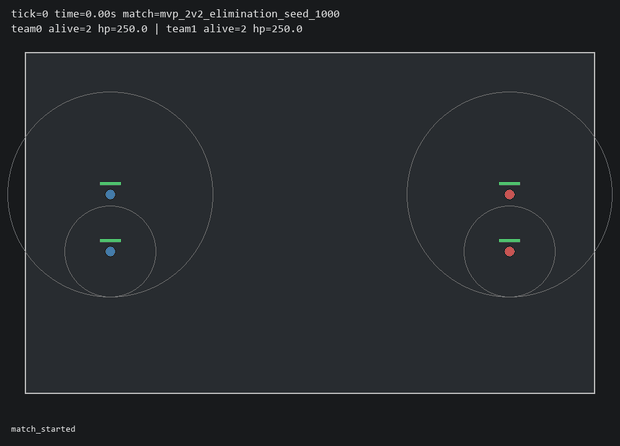
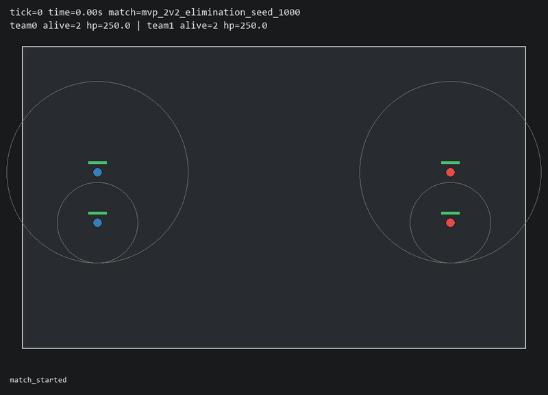
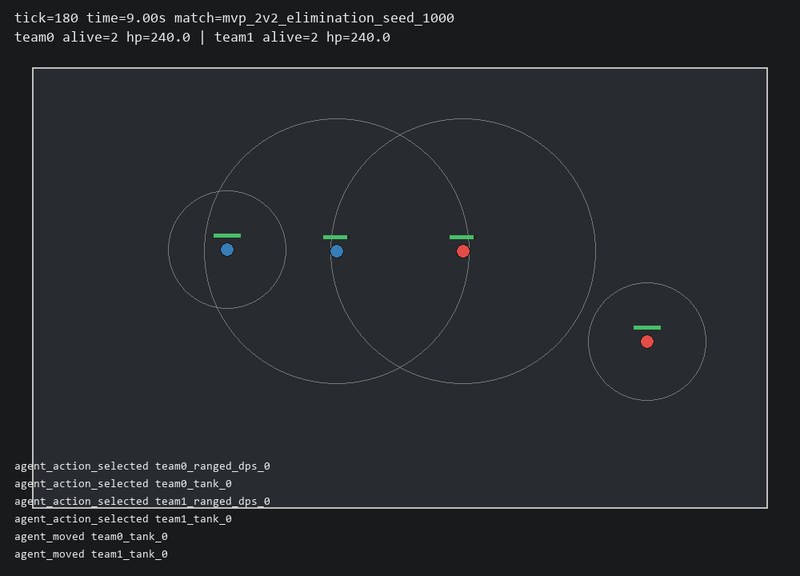
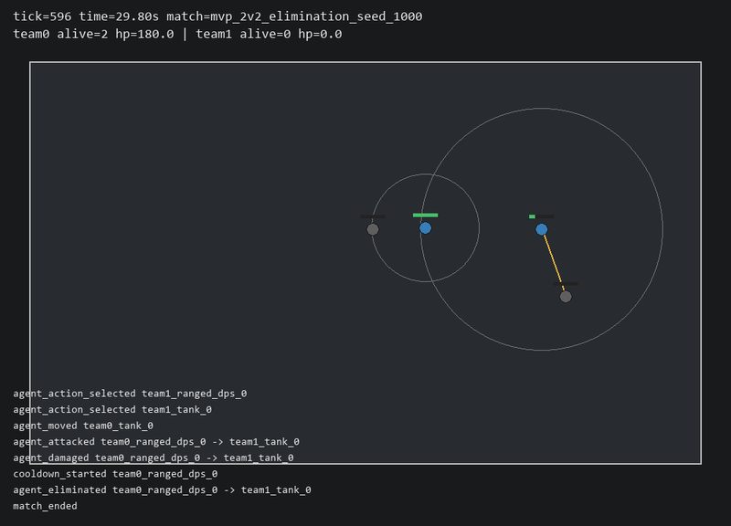

<div align="center">

# ⚔️ CombatRL

**A deterministic, headless-first tactical arena for reinforcement-learning research,
multi-agent behavior, replay analytics, and natural-language behavior control.**

[](https://www.python.org/)
[](LICENSE)
[](https://github.com/astral-sh/ruff)
[](https://mypy-lang.org/)
[](https://stable-baselines3.readthedocs.io/)

<br/>



<sub><i>A PPO policy (blue, controlling the bottom-left ranged DPS) advancing from spawn, engaging at range,
and eliminating the enemy team — rendered directly from a saved replay. Circles are attack ranges,
bars are HP, orange lines are live attacks.</i></sub>

</div>

---

## Overview

CombatRL is a compact tactical combat simulator built **simulator-first**: a deterministic,
fully-typed core with stable schemas and replay-based debugging, so every layer above it —
the Gymnasium environment, PPO training, the evaluation harness, behavior profiles, and a
natural-language command parser — can be tested and trusted independently.

The design goal is reproducibility. The same seed produces the same match, byte-for-byte
(ignoring timestamps), and **every match can be replayed, validated, and rendered from disk
without ever recomputing simulation logic**. That makes results auditable instead of anecdotal.

### What it does

- 🎮 **Deterministic 1v1 / 2v2 combat sim** — discrete actions, fixed-timestep movement, minimal
  combat resolution, strict per-tick invariant checks.
- 🤖 **Gymnasium RL environment** — a thin wrapper (`CombatRLGymEnv`) exposing a 49-feature
  observation and a 10-action discrete space; all rules stay in the engine.
- 🏋️ **PPO training with a working curriculum** — Stable-Baselines3 PPO that goes from "refuses to
  fight" to **96.7% win rate** over a 5-stage shaped curriculum (see results below).
- 📊 **Evaluation harness** — fixed-seed, multi-format metrics (JSON / CSV / JSONL / Markdown +
  replay samples) with per-action histograms and edge-occupancy so degenerate policies are
  obvious at a glance.
- 🧭 **Behavior profiles** — bounded numeric control axes (aggression, caution, cohesion, spacing…)
  that rerank action candidates at inference time without retraining.
- 💬 **Natural-language → behavior** — translate `"protect ally and stay together"` into a
  validated `BehaviorProfile`, with explicit reporting of unsupported requests.
- 🎞️ **Replay-first tooling** — record, validate, and render any match deterministically from disk.

> **Heads-up — this is a research scaffold, not a polished game.** Objective control, pathfinding,
> a backend/frontend dashboard, self-play, and advanced MARL are intentionally **not** implemented
> yet. See [Limitations & honest caveats](#limitations--honest-caveats).

---

## Headline result: teaching PPO to actually fight

The baseline 2v2 PPO agent learned the *wrong* lesson perfectly: it picked `MOVE_UP` **100%** of
the time, sprinted to a wall, and camped there until timeout — because spawns are ~70 units apart,
attack range is only 18, and passivity is a safe local optimum. Random exploration essentially
never lands a hit, so there's no gradient toward combat.

The fix was **structural, not hyperparameter tuning**: opt-in reward shaping (approach / in-range /
landed-hit bonuses + an edge penalty) plus a **5-stage warm-started curriculum** that grows spawn
distance and opponent difficulty. The canonical sparse reward and public schemas were left
untouched; shaping is enabled only in the training configs.

### Final evaluation — canonical 2v2, 30 fixed seeds (1000–1029)

| Metric | **PPO (curriculum S5)** | Random baseline |
|---|---:|---:|
| Win rate | **0.967** (29/30) | 0.000 |
| Timeout rate | 0.033 | 1.000 |
| Mean damage dealt (controlled agent) | **244.7** | 43.1 |
| Controlled-agent deaths | **0 / 30** | — |
| No-op rate | 0.000 | — |
| Edge-occupancy rate | 0.017 | — |

The trained policy advances from spawn, reaches engagement range by ~tick 200, lands its first
damage at tick 177, and personally deals the enemy team's entire 250 HP while its protector
teammate front-lines. **96.8%** of attack selections happen with an enemy actually in range —
the whiff-spam is gone.

<div align="center">
<table>
<tr>
<td align="center"><br/><sub><b>Spawn</b> — two ranged + tank per team, 70 units apart</sub></td>
<td align="center"><br/><sub><b>Engage</b> — PPO agent has closed to attack range</sub></td>
<td align="center"><br/><sub><b>Eliminate</b> — enemy team down (gray), match ends</sub></td>
</tr>
</table>
</div>

📄 Full write-up with root-cause analysis, per-stage curriculum table, and caveats:
[`artifacts/reports/ppo_trainability_pass_20260610.md`](artifacts/reports/ppo_trainability_pass_20260610.md)

**Reproduce the demo above** (requires the renderer extra):

```powershell
uv run python scripts/render_replay.py artifacts/metrics/evaluations/eval_20260610T222204Z_mvp_2v2_elimination_model_final_seed-1000-1029/replays/seed_1000/mvp_2v2_elimination_seed-1000
```

---

## Quickstart

```powershell
# 1. Install (core + dev tooling)
uv sync --extra dev

# 2. (Optional) add the Pygame renderer for watchable replays
uv sync --extra dev --extra renderer

# 3. Run a deterministic bot match and save a replay
uv run python scripts/run_match.py --team0-policy aggressive --team1-policy defensive --seed 42 --save-replay

# 4. Render it
uv run python scripts/render_replay.py <printed_replay_path>
```

The Gymnasium environment in five lines:

```python
from combatrl.envs import CombatRLGymEnv

env = CombatRLGymEnv("configs/env/gym_2v2_controlled_ranged.yaml")
observation, info = env.reset(seed=42)
observation, reward, terminated, truncated, info = env.step(0)
env.close()
```

---

## How it works

```
                 natural language ("kite back and avoid close combat")
                                  │
                          ┌───────▼────────┐
                          │  NLP parser    │  → validated BehaviorProfile
                          └───────┬────────┘
                                  │ reranks action candidates (no retrain)
   heuristic / profiled / PPO ───▶│
                                  │
                          ┌───────▼────────┐    ┌──────────────────┐
                          │ CombatRLGymEnv │◀──▶│  PPO (SB3) train │
                          │   (wrapper)    │    │  + curriculum    │
                          └───────┬────────┘    └──────────────────┘
                                  │ all rules + win conditions live here
                          ┌───────▼────────┐
                          │ SimulationEngine│  deterministic, fixed timestep
                          └───────┬────────┘
                                  │ emits frames + events
                    ┌─────────────▼─────────────┐
                    │ Replays (metadata/frames/ │ → validate → render
                    │ events/summary, on disk)  │ → P9 evaluation metrics
                    └───────────────────────────┘
```

**Per-tick the engine executes** (and validates invariants at the end):
validate actions → resolve movement → resolve attacks → apply deaths → decrement cooldowns →
evaluate terminal state → increment tick.

The Gymnasium layer is *only* a wrapper — state transitions and win conditions stay in
`SimulationEngine`, so the RL stack never becomes the source of truth for game rules.

---

## Usage reference

<details>
<summary><b>Simulator model</b></summary>

Actions are discrete `ActionCommand` values: `NO_OP`, eight cardinal/diagonal movement actions,
and `ATTACK_NEAREST`. Movement uses fixed-timestep integration:

```text
new_position = old_position + normalized_direction * movement_speed * dt
dt           = 1.0 / tick_rate_hz
```

Diagonal movement is normalized, positions clamp to the arena, and dead agents cannot act.
Combat is intentionally minimal: `ATTACK_NEAREST` picks the nearest alive enemy in range, breaks
ties by sorted `agent_id`, applies instant damage, clamps HP at zero, and sets attack cooldown
on a successful hit.

</details>

<details>
<summary><b>Heuristic baseline agents</b></summary>

| Policy ID | Behavior |
|---|---|
| `random` | Seeded uniform random simple actions |
| `aggressive` | Closes on the lowest-HP live enemy and attacks when ready |
| `defensive` | Retreats when low HP / pressured, regroups, attacks from safer positions |
| `kiter` | Stays near attack range, backs up when enemies get too close |
| `protector` | Stays near vulnerable allies, attacks enemies threatening them |
| `profiled:<profile>` | Wraps the aggressive base policy with a behavior profile |
| `profiled:<base>:<profile>` | Wraps a chosen base policy with a behavior profile |

```powershell
uv run python scripts/run_match.py --team0-policy kiter --team1-policy aggressive --seed 42 --save-replay
uv run python scripts/run_match.py --team0-policy protector --team1-policy aggressive --seed 42 --save-replay

# Optional per-role overrides
uv run python scripts/run_match.py --team0-policy aggressive --team1-policy defensive `
  --team0-tank-policy protector --team0-ranged-policy kiter --seed 42
```

</details>

<details>
<summary><b>Behavior profiles</b></summary>

A profile is a numeric control object with bounded axes — aggression, caution, cohesion,
protectiveness, focus fire, greed, spacing, and a reserved objective bias. Profiles **rerank
valid action candidates at inference time**; they do not retrain policies, change simulator
rules, mutate state, emit raw actions, or alter observation shape. Presets live under
`configs/profiles/`: `balanced`, `aggressive`, `defensive`, `kiter`, `protective`.

```powershell
uv run python scripts/compare_profiles.py --profiles aggressive defensive protective kiter balanced `
  --base-policy aggressive --num-seeds 10 --save-replays
```

Comparisons run through the P9 evaluation framework and emit per-profile metrics, JSON/CSV
summaries, a Markdown report, and one sample replay per profile. Expected coarse signals:
higher attack rate (aggressive), higher retreat rate (defensive), lower ally distance
(protective), greater enemy spacing (kiter).

</details>

<details>
<summary><b>Natural-language command parser</b></summary>

P10 maps natural language onto the existing `BehaviorProfile` schema. The NLP layer is a
**translator, not a controller**: it never calls `env.step`, emits raw action IDs, mutates state,
or invents unsupported fields.

```powershell
uv run python scripts/parse_command.py "play aggressively"
uv run python scripts/parse_command.py "protect ally and stay together"
uv run python scripts/parse_command.py "kite backward and avoid close combat"
uv run python scripts/parse_command.py "teleport behind them and buy items"   # → reported as unsupported

# Save a parsed profile, or run command-driven comparisons
uv run python scripts/parse_command.py "protect ally" --output-profile artifacts/profiles/protect_ally.yaml
uv run python scripts/compare_command_profiles.py --commands "play aggressively" "protect ally" "kite backward" --num-seeds 3 --save-replays
```

A deterministic rule mode is always available; an optional structured-output LLM interface
accepts an **injected callable** (tests use fakes — no network or API key required). Unsupported
requests (teleport, items, fog, wards, ultimates, heals, revives, summons, building, …) are
listed explicitly in `unsupported_requests`.

</details>

<details>
<summary><b>Gymnasium environment</b></summary>

Default config: `configs/env/gym_2v2_controlled_ranged.yaml`. The wrapper controls
`team0_ranged_dps_0`, runs a scripted `protector` teammate, and faces `aggressive` + `random`
scripted opponents by default.

- **Observation:** `Box(low=-1.0, high=1.0, shape=(49,), dtype=float32)` — self features, one ally
  slot, two enemy slots, arena features, and simple tactical features.
- **Action:** `Discrete(10)` — `0` NO_OP, `1`–`8` cardinal/diagonal movement, `9` ATTACK_NEAREST.
- **Reward:** a breakdown with win/loss, damage dealt/taken, death, ally death, invalid action,
  and time components.

```powershell
uv run python scripts/check_env.py --env-config configs/env/gym_2v2_controlled_ranged.yaml --episodes 5 --seed 42
uv run python scripts/run_2v2_env_episode.py --env-config configs/env/gym_2v2_controlled_ranged.yaml --seed 42 --policy random --save-replay
```

Full contract: [`docs/rl_environment.md`](docs/rl_environment.md), [`docs/phase_p5.md`](docs/phase_p5.md).

</details>

<details>
<summary><b>PPO training</b></summary>

Stable-Baselines3 PPO with `MlpPolicy`, `DummyVecEnv`, separate train/eval envs, unique
vector-env seeds, CPU execution, checkpoint callbacks, and local JSON/CSV artifacts. Training is
fully headless (no renderer / browser / FastAPI / Pygame imports).

```powershell
# Smoke run — proves PPO, checkpointing, eval, metadata, and replay capture all work
uv run python scripts/train_ppo.py --config configs/training/ppo_1v1_baseline.yaml --smoke

# Real combat-capable policy: the staged curriculum, warm-started stage to stage
uv run python scripts/train_ppo.py --config configs/training/ppo_curriculum_s1_close1v1.yaml
# … through ppo_curriculum_s5_2v2.yaml, each with --init-checkpoint <previous run>/model_final.zip
```

Artifacts land under `artifacts/checkpoints/<config>/run_<timestamp>/`: `model_final.zip`,
`best_model.zip`, resolved `config.yaml`, `model_metadata.json`, `metrics.json`,
`evaluation_metrics.json`, `eval_history.csv`, and optional `sample_replays/`. See
[`docs/rl_training.md`](docs/rl_training.md).

</details>

<details>
<summary><b>Evaluation framework</b></summary>

Evaluation runs write to `artifacts/metrics/evaluations/<evaluation_id>/`:
`evaluation_result.json`, `per_match_metrics.csv`, `per_match_metrics.jsonl`,
`evaluation_report.md`, and optional replay samples. Metrics are computed from replay
frames/events where possible — match outcome, damage, survival, spacing, attack/retreat/no-op
rates, ally distance, cohesion, edge occupancy, per-action histograms, and best-effort teamwork
metrics.

```powershell
# Heuristic, profiled, or PPO-checkpoint evaluation
uv run python scripts/evaluate_policy.py --scenario configs/env/gym_2v2_controlled_ranged.yaml --policy-type heuristic --policy-id aggressive --seed-start 100 --num-seeds 30 --save-replays
uv run python scripts/evaluate_policy.py --scenario configs/env/gym_2v2_controlled_ranged.yaml --policy-type ppo_checkpoint --checkpoint <checkpoint_path> --seed-start 1000 --num-seeds 30
```

> Don't draw strong conclusions from fewer than 20 matches; prefer ≥30 seeds and always inspect
> representative replays first.

</details>

<details>
<summary><b>Replays</b></summary>

Each replay directory contains `metadata.json`, `frames.jsonl`, `events.jsonl`, and
`summary.json`.

```powershell
uv run python scripts/validate_replay.py <replay-dir>
uv run python scripts/render_replay.py <replay-dir>
```

Renderer controls: `Space` pause/play · `←/→` step while paused · `1`/`2`/`4` speed · `Esc` quit.
Schema details: [`docs/replay_schema.md`](docs/replay_schema.md).

</details>

---

## Limitations & honest caveats

A portfolio project earns more trust by being explicit about what it *doesn't* show. From the
[trainability report](artifacts/reports/ppo_trainability_pass_20260610.md):

- **Narrow scenario distribution.** The canonical scenario has *fixed spawns*, so with a
  deterministic policy nearly all per-seed variation comes from the random opponent bot. The win
  is real, but the distribution it generalizes over is narrow.
- **No kiting learned — because nothing forced it.** The policy is a "ranged carry": it does
  almost all team damage and trades HP frugally, but it does **not** visibly kite or retreat at
  low HP. There was no opponent pressure that rewarded learning to.
- **Shaping rewards stay on in the final training stage.** Evaluation metrics (wins, damage,
  behavior) are computed from replays and are shaping-independent, but the sparse objective was
  not annealed back in to confirm it sustains the behavior on its own.
- **Scope.** Objective control, pathfinding, a backend/frontend dashboard, PettingZoo, self-play,
  opponent pools, and advanced MARL are not implemented yet.

Suggested follow-ups (non-blocking): randomize spawns, anneal shaping toward zero, train the tank
slot, and introduce stronger/mixed opponents before any self-play work.

---

## Project layout

```text
src/combatrl/
├── core/         deterministic primitives & types
├── sim/          SimulationEngine (rules, win conditions)
├── schemas/      Pydantic schemas (config, replay, env contracts)
├── agents/       heuristic baseline policies
├── envs/         CombatRLGymEnv + reward builder
├── training/     Stable-Baselines3 PPO training & curriculum
├── evaluation/   fixed-seed metrics & report generation
├── profiles/     numeric behavior-profile control
├── nlp/          natural-language → BehaviorProfile parser
├── replay/       replay reader/writer
└── renderer/     optional Pygame replay renderer
scripts/          CLI entry points (run / train / evaluate / parse / render)
configs/          env, training, and profile YAML configs
docs/             phase notes & design specs
artifacts/        checkpoints, evaluation metrics, replays, reports (generated)
tests/            62 test modules across unit & integration suites
```

---

## Development

```powershell
uv run pytest                      # test suite
uv run ruff check .                # lint
uv run ruff format --check .       # format check
uv run mypy src                    # type check
```

A fuller manual-verification checklist (bot matchups, determinism re-runs, visual confirmation of
aggressive/defensive/kiter/protector behavior) lives at the bottom of the relevant phase docs.

---

## Roadmap

CombatRL is built in phases; **P10** (natural-language → profile parsing) is the current head.

| Phase | Focus | Status |
|---|---|:--:|
| P3–P4 | Deterministic sim, replays, heuristic agents | ✅ |
| P5–P6 | Gymnasium environment & PPO baseline | ✅ |
| P7 | 2v2 team-aware environment | ✅ |
| P8–P9 | Behavior profiles & evaluation framework | ✅ |
| P10 | Natural-language command parser | ✅ |
| **P11** | **Backend & frontend dashboard** | 🔜 next |

Design specs and per-phase completion notes live under [`docs/`](docs/).

---

## License

[MIT](LICENSE) © 2026 Cody Jung
